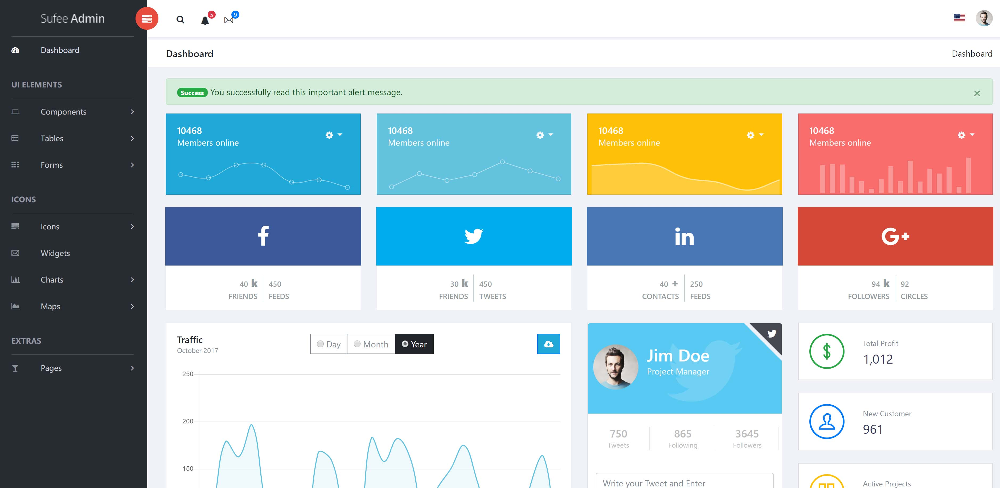

# **Build_Framework**

# **1. Create Flask Project**
First, go to the root directory of the project:
```bash
cd VisionGUI
```
Then create a ".py" file named app.py and input python code below to create a flask application:
```python
from flask import Flask
 
app = Flask(__name__)
 
@app.route('/', methods=['GET'])
def home():
    return "<h1>Hello World</h1>"
    
 
if __name__ == '__main__':
    app.run(host='0.0.0.0', port=5000, threaded=True,debug=True)
```
Then run this script to start the project:
```bash
python app.py
```
After the development server started, we can visit the website by explore:
http://127.0.0.1:5000

# **2. Prepare Web Template**

Building a practical and beautiful web gui is a complex and laborious task. Luckily, the front technology is mature enough and there are many free web templates that we can use. In our project, we choose an admin-style front template which can be downloaded from [github](https://github.com/qianbin1989228/Free-Admin-Bootstrap-Template).

Sample image from this template is shown as below:
<div align="center">
 
</div>

# **3. Render Template By Flask**
Create a folder named "templates" in VisionGUI, then go to "VisionGUI/templates" and create a html file named "home.html" in it. Additionally, we create a folder named "static" in "VisionGUI/" which provides all static files. 


