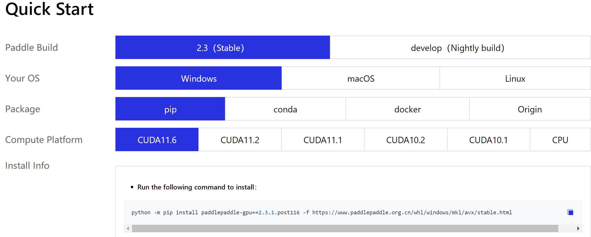

# **Prepare Environment**

## **1. Intall Python3**
Refer to the [official website](https://www.python.org/downloads/) to install Python3. If your PC already have installed python3, make sure it is >= python3.7.

## **2. Install Virtual Environment Tool**
First, upgrade pip tool to the newest version:

```bash
python -m pip install --upgrade pip
```
Then install virtualenv tool:

```bash
pip install virtualenv
```

## **3. Create and Activate Virtual Environment**
Create a virtual environment which is named as 'env':
```bash
virtualenv env
```

Then activate it:

for Windows
```bash
cd env
./Scripts/activate
```
 for Ubuntu
```bash
cd env
source envi/bin/activate
```

If correct, you can get the output as below:
```bash
(env) PS C:\Users\dl\Desktop\env> 
```

## **4. Install PaddlePaddle**

Refer to the [official website](https://www.paddlepaddle.org.cn/en/install/quick?docurl=/documentation/docs/en/install/compile/windows-compile_en.html) to install PaddlePaddle.

You need to choose the correct config according to your PC environment as below:

<div align="center">
 
</div>

Then use the command given by the website to install PaddlePaddle
```bash
python -m pip install paddlepaddle-gpu==2.3.1.post116 -f https://www.paddlepaddle.org.cn/whl/windows/mkl/avx/stable.html
```

After the installation is completed, you can type `python` to enter the python interface. Then use the python code below to verify the installation:

```python
import paddle
paddle.utils.run_check()
```

If "`PaddlePaddle is installed successfully!`" appears, it means the installation was successful.

## **5. Install Other Dependencies**
```bash
pip install -r requirements.txt
```
If the download speed is too slow, you can add "`-i https://mirror.baidu.com/pypi/simple`" to the above command. 